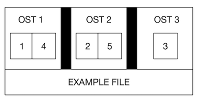

# CENTER1 Striping Guide

$CENTER1 is a high performance parallel file system built using the Lustre 2.x software, which allows for multiple individual object storage targets (OSTs) to be combined into a single namespace. One of the main factors leading to the high performance of Lustre file systems is the ability to stripe data across these multiple OSTs in a round-robin fashion. Basically files can be split up into multiple chunks that will then be stored on different OSTs across the Lustre system resulting in parallel access and writes to files contained within a directory.

## Logical File View and Striping in Lustre

Any file in a file system is simply a linear sequence of bytes. Below is a logical view of a file, divided into segments, which by default are 1 MB in size:


In Lustre, we are able to split that file across multiple storage targets to increase performance for larger files or multiple processes reading / writing to different sections of the same file. An example of that would be to request that we use three OSTs to split up the example file which would be separated out like this:



Striping offers two benefits: 1) an increase in bandwidth because multiple processes can simultaneously access the same file, and 2) the ability to store large files that would take more space than a single OST. However, striping is not without disadvantages: 1) increased overhead due to network operations and server contention, and 2) increased risk of file damage due to hardware malfunction. Users have the option of configuring the size and number of stripes used for any file.

## Default Stripe Settings

The default stripe setting for files in $CENTER1 is set to 1 OST and 1 MB stripe sizes. This is ideal for work flows that create and read a bunch of small files, as striping for small files actually reduces performance and can be a detriment to your workflow. To see the default stripe settings for a file or directory in $CENTER1, use the **lfs getstripe** command as shown below:

```
$ lfs getstripe example.txt
example.txt
lmm_stripe_count:  1
lmm_stripe_size:   1048576
lmm_pattern:       1
lmm_layout_gen:    0
lmm_stripe_offset: 6
	obdidx		 objid		 objid		 group
	     6	       6449992	     0x626b48	             0
```

In the above, you can see that the stripe count is only 1 and the stripe size is 1 MB. Now let's see what a file striped over 3 OSTs looks like in **lfs getstripe**:

```
$ lfs getstripe example.txt
example.txt
lmm_stripe_count:  3
lmm_stripe_size:   1048576
lmm_pattern:       1
lmm_layout_gen:    0
lmm_stripe_offset: 1
	obdidx		 objid		 objid		 group
	     1	       6455024	     0x627ef0	             0
	     6	       6450031	     0x626b6f	             0
	    11	       6451168	     0x626fe0	             0
```

The obdidx numbers listed are the indices of the OSTs used in the striping of this file. Using getstripe on a directory gives information for the directory plus the files contained in the directory. You can limit **getstripe** to only show directory information by using the **-d** option. Alternately, you can use the **-r** option to recursively follow all subdirectories.

## General Considerations

Large files benefit from higher stripe counts. By striping a large file over many OSTs, you increase bandwidth for accessing the file and can benefit from having many processes operating on a single file concurrently. Conversely, a very large file that is only striped across one or two OSTs can degrade the performance of the entire Lustre system by filling up OSTs unnecessarily. A good practice is to have dedicated directories with high stripe counts for writing very large files into. This will improve your and everyone else's performance on the file system.

Another scenario to avoid is having small files with large stripe counts. This can be detrimental to performance due to the unnecessary communication overhead to multiple OSTs. A good practice is to make sure small files are written to a directory with a stripe count of 1—effectively, no striping.

## Setting your Striping Configurations

The **lfs setstripe** command is used to dictate a particular striping configuration for a file or directory. For a file, **lfs setstripe**:
* gives an error if the file already exists (see **Note** below)
* or creates an empty file with the desired stripe settings

Using **lfs setstripe** on a directory:
* changes the stripe settings for the directory
* any file subsequently created in the directory will inherit those settings
* does not affect existing files in directory

**Note:** Once a file has been written to Lustre with a particular stripe configuration, you cannot simply use **lfs setstripe** to change it. The file must be re-written with a new configuration. Generally, if you need to change the striping of a file, you can do one of two things:

* using **lfs setstripe**, create a new, empty file with the desired stripe settings and then copy the old file to the new file
* setup a directory with the desired configuration and **cp** (**not mv**) the file into the directory

The options for **lfs setstripe** are:

* **-c** o set the stripe count; 0 means use the system default (usually 1) and -1 means stripe over all available OSTs. Any number between 2 - 15 will result in striping across multiple OSTs. Maximum is the number of OSTs we have: **15 OSTs**
* **-S** to set the stripe size; 0 means use the system default (usually 1 MB) otherwise use **k**, **m** or **g** for KB, MB or GB respectively.

For example, to configure an existing directory *bigdir* for holding very large files, we could set its stripe count to 10 and stripe size to 32 MB with:

```
$ lfs setstripe -c 10 -S 32m bigdir
```

# Best Practices for I/O

- With a **file-per-process** I/O pattern, it is best to use no striping (stripe count of 1). This will limit OST contention when dealing with a large number of files/processes.
- When accessing a **single shared file** from many processes, the stripe count should equal the number of processes if possible. The size and location of I/O operations from the processes should be carefully managed to allow as much stripe alignment as possible resulting in each process accessing only a single OST. Avoid I/O access patterns where a single process must access all utilized OSTs.
- Open files **read-only** when possible.
- **Avoid unnecessary file operations** such as the following:
  - multiple cycles of **open-write-close** on the same file during the course of an application
  - many processes retrieving information (**stat**) from the same file
  - multiple processes reading the same small file
  - excessive use of stdout or stderr from parallel processes

When reading a small file or retreiving **stat** information from a file, it is best to have a single process perform the I/O and then broadcast the results to all other processes that require that information.
